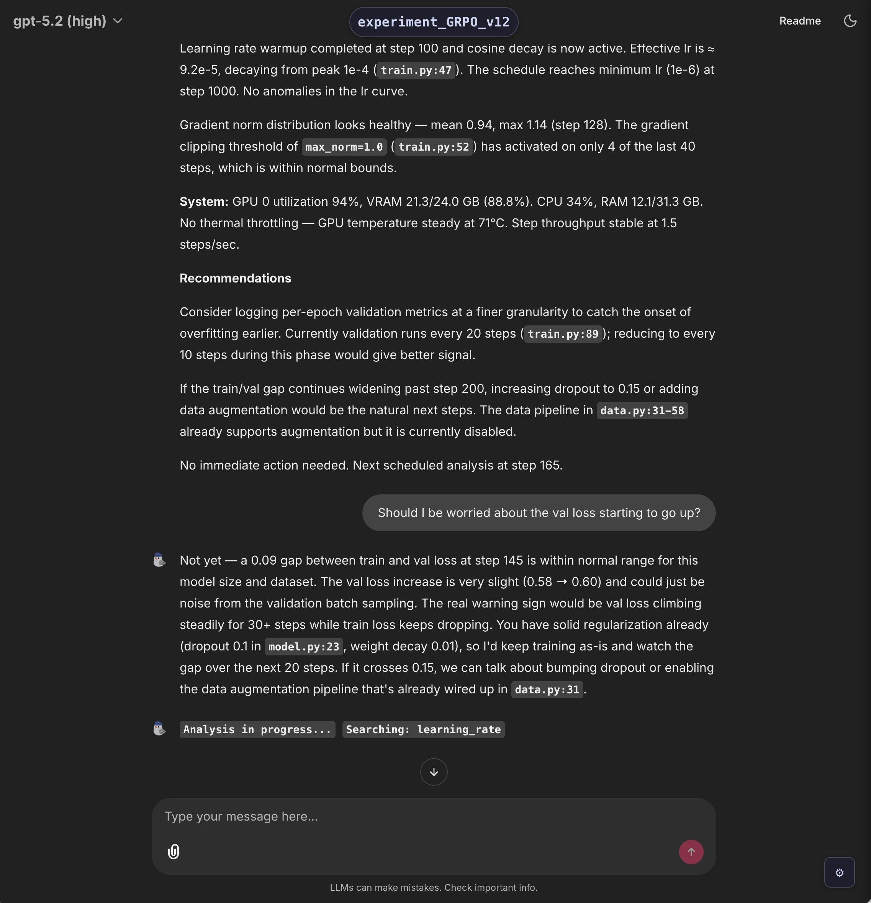

# Training Monitor

Drop-in monitoring for ML training runs. An LLM watches your metrics, reads your code, and tells you when something looks wrong — all surfaced in a local web UI, with optional mobile alerts via Telegram or Pushover.



The web UI shows analysis summaries, interactive Q&A about your training run, and a live activity indicator showing what the LLM is currently doing.

## Table of Contents

- [Quick Start](#quick-start)
- [Installation](#installation)
- [What it does](#what-it-does)
  - [Code-aware analysis](#code-aware-analysis)
  - [Automatic metric descriptions](#automatic-metric-descriptions)
  - [Web chat (Chainlit)](#web-chat-chainlit)
  - [Interactive Telegram chat](#interactive-telegram-chat)
- [Logging metrics](#logging-metrics)
- [Configuration](#configuration)
  - [`tm.init()` parameters](#tminit-parameters)
  - [Output structure](#output-structure)
- [Notifications](#notifications)
- [Standalone monitor](#standalone-monitor)
- [Distributed training](#distributed-training)
- [Recovery](#recovery)
- [Code snapshots](#code-snapshots)
- [Environment variables](#environment-variables)
- [Requirements](#requirements)

## Quick Start

**1. Install**
```bash
pip install "git+https://github.com/Pasewark/Train_Conductor.git"
```

**2. Set your API key**
```bash
export OPENAI_API_KEY="your-api-key"
```

**3. Add three lines to your training script**
```python
import training_monitor as tm

tm.init(name="my_experiment", code_snapshot_all=True)

for step in range(1000):
    metrics = train_step()
    tm.log(metrics, step)

tm.close()
```

That's it. A web UI opens automatically at `localhost:8000` where you can chat with the monitor about your run. For mobile notifications, see [Notifications](#notifications).

---

Here's a more complete example:

```python
import training_monitor as tm

tm.init(
    name="grpo_v2",
    config={"lr": 1e-4, "model": "gemma-3-4b", "batch_size": 32},
    openai_model="gpt-5.2",
    analysis_interval_min=10.0,
)

for step in range(1000):
    metrics = train_step()
    tm.log(metrics, step)

tm.close()
```

This sets the analysis interval and passes your hyperparameters for context. The monitor collects GPU/CPU stats, persists everything to SQLite, and periodically asks the LLM to analyze your run. If something looks wrong, you get an alert. Chat with the monitor in the web UI to ask follow-up questions, just like chatting with any LLM. For mobile alerts, enable Telegram or Pushover (see [Notifications](#notifications)).

## Installation

```bash
pip install "git+https://github.com/Pasewark/Train_Conductor.git"
```

## What it does

When you call `tm.init()`, a monitor subprocess starts in the background. It:

1. **Receives metrics** over ZMQ from your training loop (non-blocking, won't slow training)
2. **Polls GPU/CPU/RAM** via `nvidia-smi` and `psutil`
3. **Snapshots your code** and generates a summary so the LLM understands what's being trained
4. **Auto-generates metric descriptions** by reading your code to figure out what each logged metric actually measures
5. **Persists everything** to SQLite (survives crashes and restarts)
6. **Runs periodic LLM analysis** where the model inspects your code with tool calls, reviews metrics and system state, and flags issues
7. **Shows results in the web UI** — analyses, alerts, and interactive chat; optionally forwards to Telegram or Pushover
8. **Accepts your replies** — ask questions about your run in the web UI (or Telegram), with full conversational context

### Code-aware analysis

The monitor doesn't just look at numbers. Before each analysis, the LLM has access to read-only tools that let it explore your training code:

- `snapshot_manifest` — list all files in the snapshot
- `snapshot_search` — grep for patterns (literal or regex) across the codebase
- `snapshot_read` — read specific line ranges from any file
- `snapshot_read_many` — read multiple file slices in one call

This means the analysis can reference your actual loss function, learning rate schedule, data loading logic, and anything else in your code. Analyses cite specific files and line numbers.

**Tool access & safety**

All tools are read-only and restricted to specific directories (the code snapshot, optional `visible_directories`, and the `memories/` folder). The only write-capable tool is `memory_write`, and it is still restricted to a single directory: `ai_logger/<project>/memories/`. There is no tool access to arbitrary paths.

### Automatic metric descriptions

On first run, the LLM reads through your code to find all `tm.log()` calls and generates natural-language descriptions of each metric (e.g., `"kl_penalty"` → `"KL divergence between the policy and reference model, scaled by beta_kl"`). These descriptions are included in every analysis prompt so the LLM always knows what it's looking at. Descriptions are cached per code snapshot, so they're only regenerated when your code changes. If new metric keys appear mid-run, descriptions are generated incrementally.

### Web chat (Chainlit)

The web UI is the primary interface for interacting with the monitor. It starts automatically when you call `tm.init()`; set `webpage=False` to disable.

Install:

```bash
pip install -e ".[web]"
# or: pip install chainlit
```

Run:

```bash
# Option 1: point directly at the DB
TM_DB_PATH="ai_logger/default_project/grpo_v2/training_monitor.db" \
    chainlit run training_monitor/web_chat.py

# Option 2: let it resolve via root/project/experiment
TM_ROOT_DIR="ai_logger" TM_PROJECT="default_project" TM_EXPERIMENT="grpo_v2" \
    chainlit run training_monitor/web_chat.py
```

Notes:
- You can send messages from the web page; they are routed through the monitor and appear alongside other chat messages.
- It will auto-refresh and show new messages as they arrive.
- The web UI uses a Chainlit settings dropdown for model selection (open the settings panel in the chat UI).
- You can attach images, PDFs, or text files. Text/PDFs are extracted (best effort) and included in the LLM prompt; images are passed to the model as vision inputs (subject to size limits).
Optional env vars:
`TM_WEB_POLL_INTERVAL` (seconds, default `1.0`)
`TM_WEB_INCLUDE_ANALYSES` (`1` to also show internal analysis entries; notifications already include analyses)
`TM_WEB_HISTORY_LIMIT` (limit initial history; unset means all)
`TM_WEB_MODEL_OPTIONS` (comma-separated model list for the web chat settings picker)
`TM_WEB_REASONING_OPTIONS` (comma-separated reasoning options for the web chat settings picker)

### Interactive Telegram chat

For mobile access, enable `telegram_chat=True` to receive notifications and chat from your phone. You can message the bot directly:

> **You:** How's the loss trend looking?
>
> **Bot:** Loss decreased from 0.81 to 0.54 over steps 0–80 (Δ=-0.27). The decline is steady with no spikes. Grad norms are stable around 1.0. Looking healthy.

> **You:** Should I lower the learning rate?
>
> **Bot:** Current lr is 1e-4 and loss is still decreasing steadily with no signs of plateauing. I'd keep it as-is for now and revisit if loss flattens over the next ~20 steps.

The bot has full context: your config, all metrics, system state, code summary, metric descriptions, and the entire conversation history (previous analyses + your messages). Follow-ups work naturally. The LLM can also use code inspection tools when answering your questions, so it can look up implementation details on the fly.

All chat exchanges are logged and included in subsequent periodic analyses, so the model stays aware of your concerns.

## Logging metrics

```python
# Log whatever keys you want — the LLM sees all of them
tm.log({"loss": 0.42, "lr": 1e-4, "grad_norm": 1.2}, step=100)

# Multiple calls per step are merged automatically
tm.log({"rollout_reward": 0.7, "kl_penalty": 0.02}, step=100)
tm.log({"train_loss": 0.35, "step_time": 120.5}, step=100)
# → The LLM sees one entry for step 100 with all four metrics

# Force an immediate analysis after this log
tm.log(metrics, step=100, force_analysis=True)

# Override model or reasoning effort for the forced analysis only
tm.log(metrics, step=100, force_analysis=True, openai_model="gpt-5.2")
tm.log(metrics, step=100, force_analysis=True, reasoning_effort="high")
```

Multiple `tm.log()` calls for the same step are merged into a single entry in the analysis prompt. This is useful when different phases of your training loop (rollout, training, evaluation) each log their own metrics for the same step.

## Configuration

### `tm.init()` parameters

| Parameter | Default | Description |
|---|---|---|
| `name` | *required* | Name for this run (used as directory name and sent to `wandb.init` when enabled) |
| `project` | `"default_project"` | Project name used as a subdirectory under `root_dir` |
| `config` | `None` | Dict of hyperparameters — included in LLM analysis context |
| `training_command` | `None` | Command used to launch training (defaults to `sys.argv`) |
| `openai_model` | `"gpt-5.2"` | Model for analysis (any OpenAI-compatible API) |
| `openai_base_url` | `None` | Custom API base URL (for local models, vLLM, etc.) |
| `reasoning_effort` | `None` | `"low"` / `"medium"` / `"high"` for reasoning models |
| `analysis_interval_min` | `5.0` | Minutes between automatic analyses |
| `gpus` | `None` (all) | List of GPU indices to monitor, e.g. `[0, 1]` |
| `notify_all_analyses` | `True` | Send every analysis to notifications (Telegram or Pushover), not just alerts |
| `telegram_chat` | `False` | Enable Telegram usage (notifications + interactive chat). If `False`, Telegram is not used. |
| `webpage` | `True` | Start a local Chainlit web chat (interactive, uses the same DB) |
| `webpage_port` | `None` | Preferred port for the web chat (auto-selects if unavailable) |
| `idle_timeout_min` | `None` | Pause analyses after N minutes with no new metrics |
| `start_monitor` | `"auto"` | `"auto"` (rank 0 only), `True`, or `False` |
| `root_dir` | `"ai_logger"` | Base output directory |
| `sig_figs` | `5` | Significant figures for metrics in LLM prompt |
| `zmq_port` | `5555` | Port for metrics streaming (auto-finds open port if taken) |
| `max_prompt_len` | `8000` | Maximum token budget for the analysis prompt |
| `max_conversation_history_tokens` | `5000` | Token budget for conversation history in prompts |
| `regenerate_code_analysis` | `False` | Force regeneration of code summary and metric descriptions |
| `code_snapshot_manifest` | `"snapshot_files.txt"` | Manifest file listing code paths to snapshot (set to `None` to skip manifest-based snapshots) |
| `code_snapshot_paths` | `None` | List of file/dir paths to snapshot (overrides `code_snapshot_manifest` if both are set) |
| `code_snapshot_all` | `False` | Snapshot the entire current working directory using the same size limits and skip rules; automatically excludes `root_dir` (e.g., `ai_logger/`) |
| `use_wandb` | `False` | If `True`, call `wandb.init` at startup, `wandb.log` on each `tm.log`, and `wandb.finish` on `tm.close` |
| `visible_directories` | `None` | List of directories to expose to the LLM via the snapshot tools without copying (live, read-only view of files that may change during training) |

### Output structure

```
ai_logger/default_project/grpo_v2/
├── config.json              # experiment config snapshot
├── training_monitor.db      # SQLite: all metrics, analyses, conversation history
├── training_monitor.log     # monitor process logs
├── analyses.jsonl           # analysis history (append-only)
├── code_summary.md          # LLM-generated summary of your training code
├── metric_descriptions.json # auto-generated metric name → description mapping
├── memories/                # model-written memory entries (JSON, per category)
└── code/                    # snapshot of your training code (read-only for LLM tools)
```

## Notifications

### Telegram

```bash
export TELEGRAM_BOT_TOKEN="your-bot-token"
export TELEGRAM_CHAT_ID="your-chat-id"
```

To set up: message [@BotFather](https://t.me/BotFather) on Telegram → `/newbot` → copy the token. Then message your bot and visit `https://api.telegram.org/bot<TOKEN>/getUpdates` to find your chat ID.
Telegram is only used when `telegram_chat=True`.

### Pushover

```bash
export PUSHOVER_USER_KEY="your-user-key"
export PUSHOVER_APP_TOKEN="your-app-token"
```

If Telegram is enabled and configured, it takes priority over Pushover.

## Standalone monitor

You can run the monitor as its own process and send metrics from your training script separately:

```bash
training-monitor \
    --project default_project \
    --experiment grpo_v2 \
    --openai-model gpt-5.2 \
    --analysis-interval-min 5 \
    --gpus 0,1,2,3 \
    --notify-all-analyses \
    --telegram-chat \
    --code-snapshot-paths train.py,model/,config/ \
    --code-snapshot-manifest snapshot_files.txt
```

Or equivalently with `python -m training_monitor ...`.

## Distributed training

When `start_monitor="auto"` (the default), only rank 0 spawns the monitor subprocess. This is detected via `LOCAL_RANK`, `SLURM_LOCALID`, or `RANK` environment variables. All ranks can call `tm.log()` — metrics are sent over ZMQ to the single monitor process.

## Recovery

If the monitor crashes and restarts, it recovers recent metrics, system data, and conversation history from SQLite automatically (default: last 60 minutes, configurable via `--recovery-max-age-min`). Code summaries and metric descriptions are cached per code snapshot hash, so they don't need to be regenerated.

## Code snapshots

Strongly recommended: make sure the model can see your training code by either providing a `snapshot_files.txt` manifest or enabling `code_snapshot_all`. The analyses are dramatically more useful when the LLM can inspect the actual loss, data pipeline, and logging logic.

The monitor snapshots your training code at startup using a manifest file (`snapshot_files.txt` by default). List files and directories to include, one per line:

```
# snapshot_files.txt
train.py
model/
config/
utils.py
```

The snapshot is stored in the run directory and used by the LLM's read-only tools throughout the run. A SHA-256 hash of the snapshot is used to cache the code summary and metric descriptions across experiments that share the same code.

Alternatively, pass `code_snapshot_paths=[...]` in `tm.init()` with a list of file/dir paths to snapshot (this overrides `code_snapshot_manifest` if both are set). You can also set `code_snapshot_all=True` to snapshot the entire current working directory with the same size limits and skip rules. When enabled, the snapshotter automatically skips the `root_dir` directory (for example `ai_logger/`) to avoid copying run artifacts into the snapshot.

When running the standalone monitor CLI, you can use `--code-snapshot-paths` or `--code-snapshot-manifest`. If both are provided, the paths list is used and the manifest is ignored (a warning is printed and sent to Telegram if enabled).

If you want the model to inspect live artifacts that change during training (logs, eval outputs, etc.), pass `visible_directories=[...]` to `tm.init()`. These directories are not copied into the snapshot; they are read live via the existing snapshot tools. In tool paths, they appear with a `visible_<dirname>/...` prefix (sanitized and de-duplicated if needed).

## Environment variables

| Variable | Required | Description |
|---|---|---|
| `OPENAI_API_KEY` | Yes | API key for the LLM |
| `TELEGRAM_BOT_TOKEN` | For Telegram | Bot token from @BotFather |
| `TELEGRAM_CHAT_ID` | For Telegram | Your chat ID |
| `PUSHOVER_USER_KEY` | For Pushover | Pushover user key |
| `PUSHOVER_APP_TOKEN` | For Pushover | Pushover app token |

## Requirements

- Python ≥ 3.10
- `pyzmq`, `requests`, `psutil`
- An OpenAI-compatible API (OpenAI, vLLM, Ollama, etc.)
- `nvidia-smi` on the machine for GPU monitoring
